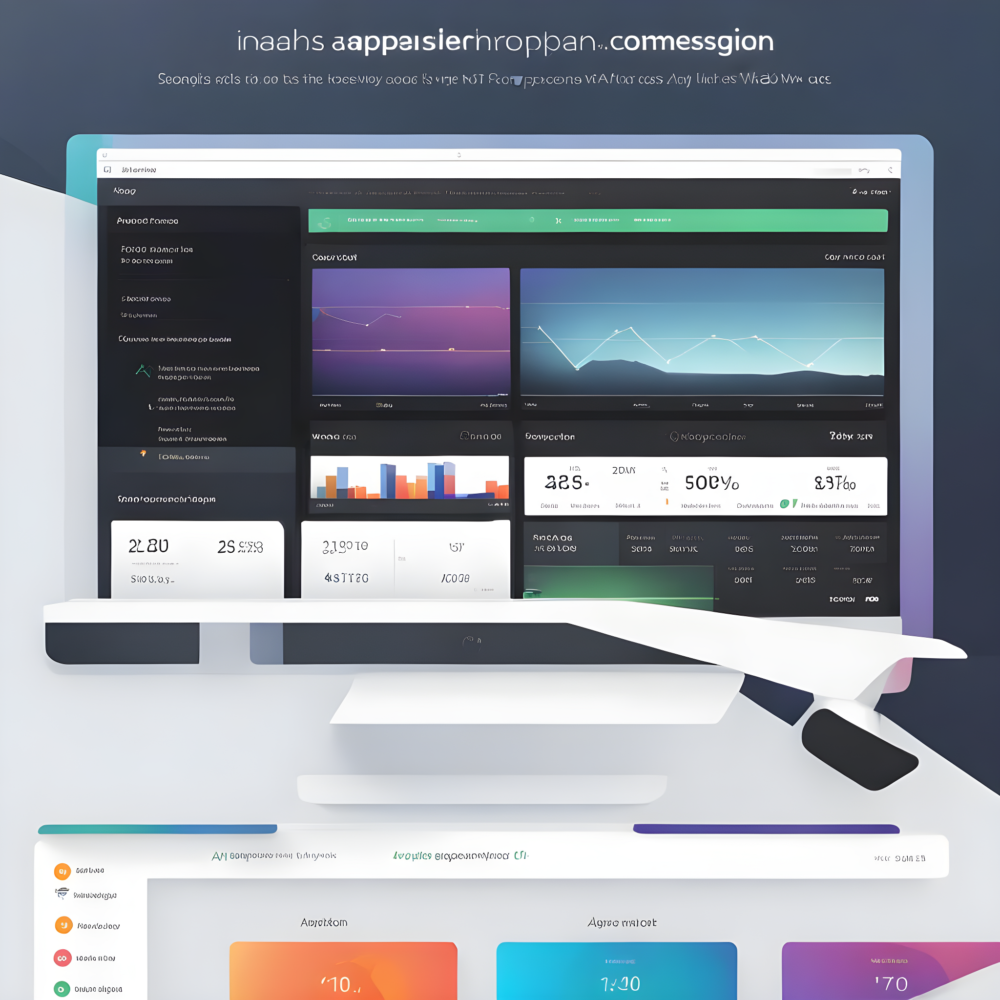

<div align="center">


</div>

<!-- PROJECT LOGO -->
<br />
<div align="center">
  <a href="https://github.com/abhijithanandan">
    
  </a>
  <h3 align="center">A Video Compression API</h3>
  <div align="center">
    A dockerized API for video compression using Handbrake CLI built in python
    <br />
    <a href="https://github.com/abhijithanandan/VideoCompressionAPI/docs/README.md"><strong>Explore the docs »</strong></a>
    <br />
    <br />
    <a href="https://github.com/abhijithanandan/VideoCompressionAPI/demo/README.md">View Demo</a>
    ·
    <a href="https://github.com/abhijithanandan/VideoCompressionAPI/issues">Report Bug</a>
    ·
    <a href="https://github.com/abhijithanandan/VideoCompressionAPI/issues">Request Feature</a>
  </div>
</div>

<!-- TABLE OF CONTENTS -->
<details open>
  <summary>Table of Contents</summary>
  <ol>
    <li>
      <a href="#about-the-project">About The Project</a>
      <ul>
        <li><a href="#built-with">Built With</a></li>
      </ul>
    </li>
    <li>
      <a href="#getting-started">Getting Started</a>
      <ul>
        <li><a href="#prerequisites">Prerequisites</a></li>
        <li><a href="#installation">Installation</a></li>
      </ul>
    </li>
    <li><a href="#usage">Usage</a></li>
    <li><a href="#contributing">Contributing</a></li>
    <li><a href="#license">License</a></li>
    <li><a href="#contact">Contact</a></li>
    <li><a href="#acknowledgments">Acknowledgments</a></li>
  </ol>
</details>

<!-- ABOUT THE PROJECT -->
## About The Project

<div align="center">
  
 
  <!-- Add vertical space -->
  <br>  
  <br>  
  <br>  

</div>

* This is a Video Compression API allowing for efficient, scalable, and high-quality video file compression.
* Built with a robust and scalable backend architecture, ensuring fast processing and low latency.
* Designed to be modular and high throughput for seamless integration and deployment in various environments.

## Major Features Include:

- 🛡️ **Secure Access**: Secure API endpoints to ensure the privacy and security of the user data and videos.
- 🎞️ **Versatile Video Support**: Supports a wide array of video formats for compression.
- 🚀 **Fast Processing**: Utilizes modern compression algorithms for quick video processing.
- 📊 **Customizable Compression Settings**: Users can customize the compression settings to suit their needs.
- 💾 **Storage Solutions**: Offers seamless integration with various cloud and local storage solutions.
- 🔄 **Batch Processing**: Allows for batch video compression, enhancing the efficiency of the operations.
- 📱 **Cross-Platform Support**: API can be accessed from various platforms and devices.
- 📈 **Analytics**: Provides detailed analytics and reports on the compression statistics.
- 🌐 **Global Accessibility**: Access the API from anywhere, ensuring global reach and accessibility.
- 🔧 **Technical Support**: Round-the-clock technical support for uninterrupted operations.

<p align="right">(<a href="#readme-top">back to top</a>)</p>

### Built With

<!-- Using Devicon font -->
<!--  -->  
<!-- * [![Flutter][Flutter-Icon]][https://flutter.dev] -->

<!-- Using skill-icons -->
<div align="center">
  <a href="https://skillicons.dev">
    
  </a>
</div>

<p align="right">(<a href="#readme-top">back to top</a>)</p>

<!-- Using Shields.io and Simple Icons -->
<!--    -->


<!-- GETTING STARTED -->
## 🚀 Getting Started

* This API can be run on any machine with Docker installed.
* The following instructions will help you get a copy of the project up and running on your local machine for development and testing purposes.
### Prerequisites

This is an example of how to list things you need to use the software and how to install them.

* Ensure you have Python installed on your system.
* If not, follow the [Python installation guide](https://www.python.org/downloads) for your operating system.
* Ensure you have Docker and Docker-compose installed on your system.
* If not, follow the [Docker installation guide](https://docs.docker.com/get-docker) for your operating system.
* Ensure Github SSH is set up on your system.
* If not, follow the [GitHub SSH setup guide](https://docs.github.com/en/github/authenticating-to-github/connecting-to-github-with-ssh) for your operating system.

### Installation
1. Clone this repository using the command:
  ```sh
    git clone git@github.com:abhijithanandan/VideoCompressionAPI.git
  ```
2. Navigate to the project directory:
  ```sh
    cd VideoCompressionAPI
  ```
3.Build and run the Docker container:
  ```sh
    docker-compose up --build
  ```
4.Now, the FastAPI server will start, and the API will be accessible at `http://localhost:8000`. You can view the API documentation by navigating to `http://localhost:8000/docs` in your web browser.

5.To stop the server and remove the container, you can use the following command:
  ```sh
    docker-compose down
  ```


<p align="right">(<a href="#readme-top">back to top</a>)</p>


<!-- USAGE EXAMPLES -->
## Usage

### Demo Coming Soon!

<p align="right">(<a href="#readme-top">back to top</a>)</p>

<!-- CONTRIBUTING -->
## Contributing

Contributions are what make the open source community such an amazing place to learn, inspire, and create. Any contributions you make are **greatly appreciated**.

If you have a suggestion that would make this better, please fork the repo and create a pull request. You can also simply open an issue with the tag "enhancement".
Don't forget to give the project a star! Thanks again!

1. Fork the Project
2. Create your Feature Branch (`git checkout -b feature/AmazingFeature`)
3. Commit your Changes (`git commit -m 'Add some AmazingFeature'`)
4. Push to the Branch (`git push origin feature/AmazingFeature`)
5. Open a Pull Request

<p align="right">(<a href="#readme-top">back to top</a>)</p>


<!-- LICENSE -->
## License

Distributed under the GNU License. See `LICENSE.txt` for more information.

<p align="right">(<a href="#readme-top">back to top</a>)</p>


<!-- CONTACT -->
## Contact

Abhijith Anandakrishnan - [@abhijithanandan](https://twitter.com/abhijithanandan) - info@abhijithanandan.com 

Project Link: [https://github.com/abhijithanandan/VideoCompressionAPI](https://github.com/abhijithanandan/VideoCompressionAPI)

<p align="right">(<a href="#readme-top">back to top</a>)</p>

## Branch Ownership

 | Status | Branch | Owner
 | --- | --- | ---
 |  | `development` | [Abhijith Anandakrishnan](abhijithananthan@gmail.com)


<!-- ACKNOWLEDGMENTS -->
## Acknowledgments

* Tornotron E Commerce Private Ltd. - [https://tornotron.com](https://tornotron.com)

<p align="right">(<a href="#readme-top">back to top</a>)</p>


